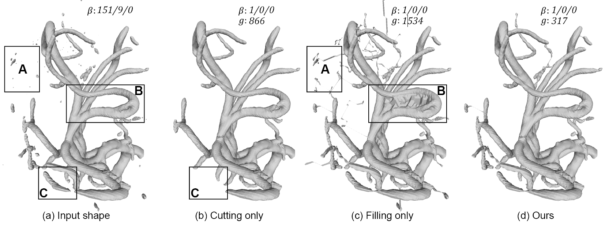
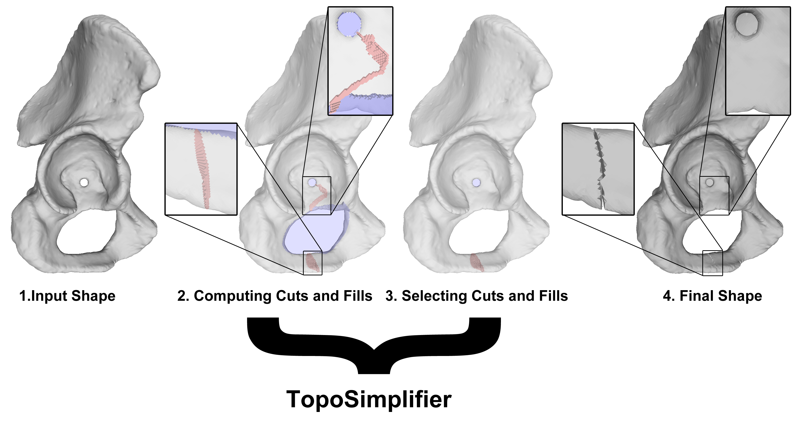
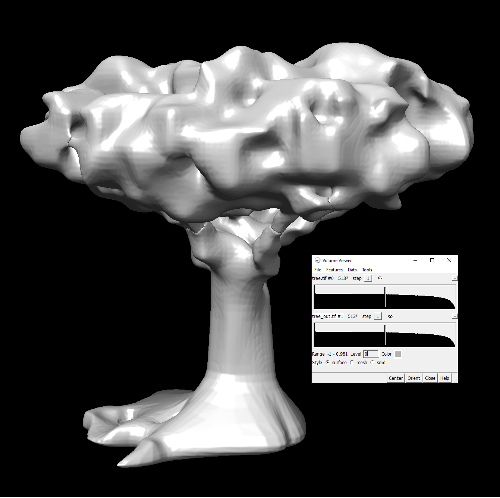

# To Cut or to Fill: A Global Optimization Approach to Topological Simplification

[Dan Zeng](http://www.dan-zeng.com), [Erin Chambers](https://cs.slu.edu/~chambers/), [David Letscher](https://cs.slu.edu/people/letscher), [Tao Ju](https://www.cse.wustl.edu/~taoju/)
 *ACM Transaction on Graphics (Proceedings of SIGGRAPH Asia 2020)* 

[`Project Page`](https://danzeng8.github.io/topo-simplifier)
[`Paper`](https://danzeng8.github.io/topo-simplifier/#paper)
[`Presentation (video)`](https://www.youtube.com/watch?v=ZP5wIIwNZFY)
[`Presentation (Powerpoint)`](https://danzeng8.github.io/topo-simplifier/images/presentation.pptx)
[`Presentation (PDF)`](https://danzeng8.github.io/topo-simplifier/images/presentation.pdf)
 
[`Dataset (input and output)`](https://www.dropbox.com/s/sz3nj5vju43nxgy/examples.zip?dl=0)
[`Only input data`](https://www.dropbox.com/s/n5lm6dlv7y8radh/examples_in.zip?dl=0)
[`Only output data`](https://www.dropbox.com/s/nt0facl375ara0p/examples_out.zip?dl=0)

## Abstract

We present a novel algorithm for simplifying the topology of a 3D shape, which is characterized by the number of connected components, handles, and cavities. Existing methods either limit their modifications to be only cutting or only filling, or take a heuristic approach to decide where to cut or fill. We consider the problem of finding a globally optimal set of cuts and fills that achieve the simplest topology while minimizing geometric changes. We show that the problem can be formulated as graph labelling, and we solve it by a transformation to the Node-Weighted Steiner Tree problem. When tested on examples with varying levels of topological complexity, the algorithm shows notable improvement over existing simplification methods in both topological simplicity and geometric distortions.

## TopoSimplifier

The program here simplifies the topology a volumetric representation of a 3D shape using a global optimization method. Given a level set of an image volume, TopoSimplifier adjusts the voxels which belong to this level set in a way which most simplifies topology, while minimizing a geometric score.

TopoSimplifier has been developed for Windows 10 (Visual Studio 2019), and has not yet been tested on other platforms.

## Building TopoSimplifier

You will need Visual Studio 2019.

Open the Visual Studio solution file TopoSimplifier.sln. Set the build mode to Release and target platform to x64. Go to Build > Build Solution. After it successfully builds, TopoSimplifier.exe will be updated in the main TopoSimplifier directory. 

It is preferred to use Windows SDK Version 10.0. You can check to see if you have this by going to Project > Properties > Configuration Properties > General > Windows SDK Version.

To check that it runs properly for the next step, open up the command prompt, use the cd command to navigate to the TopoSimplifier directory (containing TopoSimplifier.exe), and run the following command:

	TopoSimplifier --help

This will display the help menu.

## Running TopoSimplifier

TopoSimplifier runs on the command-line. Open up the command prompt and then use the "cd" command to navigate to the main TopoSimplifier directory (containing TopoSimplifier.exe). 

TopoSimplifier accepts three possible input types:
* .tif: typically for distance field volumes
* .dist: alternate format for distance field volumes
* directory with .png image slices, with each .png having a 4 digit name, ordered like 0000.png...0001.png...0002.png...NNNN.png. These are usually appropriate for image volumes from biomedical and plant imaging (e.g. X-ray CT, MRI, Cryo-EM).

The only required arguments are the input and output file. For a .tif or a .dist, this looks like:

	TopoSimplifier input.tif output.tif

Note that if the input is a .dist file, the output will be a .tif in order to make visualization easier. Hence .tif files are preferred between these two formats.

For a directory with .png image slices, this looks like:

	TopoSimplifier input/ output/

For examples to try, see the examples section of our ['project page'](https://danzeng8.github.io/topo-simplifier/#examples)

Read on for discussion about other (optional) parameters.

## Visualization of input and output

To visualize the input and output (assuming they are .tif or image slices), we highly recommend [`UCSF Chimera`](https://www.cgl.ucsf.edu/chimera/), a visualization software developed for the biomedical imaging community. UCSF Chimera allows for the visualization of both the input and output using an iso-surface and image volume, and also allows for exporting the input and output to different formats such as a .ply mesh.

Opening the input / output:
After opening up the UCSF Chimera Software, and go to File > Open. If the input / output is in .tif format, simply click on the file. If the input / output is a sequence of .png image slices in a directory, navigate to that directory in the file browser, then shift + drag your mouse to select all the .png slices in the directory. Click Open in the file browser.

Visualizing the shape: 

Go to Tools > Volume Data > Volume Viewer. Then in the Volume Viewer window change Style to "surface", step size to "1", and draw the iso-surface bar to the shape threshold which defines the shape being simplified. In the case of distance fields, this threshold will be 0. For other cases, this may vary but should match what you chose for the --S parameter (see below two sections).

Here is an example visualization in Chimera for the tree example in our dataset, using the settings above:

Input shape: 

Output shape:

Mouse controls: 
Rotate: left-draw
Translate: center-drag
Zoom" right-draw

Optionally, the iso-surface being visualized can be exported in a number of formats by going to File > Export Scene. These formats include .obj, .stl, .vtk, and .x3d. Further file conversions can be made in other software such as Meshlab (e.g. to convert to .ply).

There are no known software to visualize .dist files, because this is a customized format produced by Vega-FEM as part of their signed distance field package.

In the case of 3D shapes extracted from real images (e.g. biomedical or plant imaging), UCSF Chimera can also be used to help you decide a good value for the --S parameter of TopoSimplifier (the input level set which defines the shape to be simplified). Just drag the level set bar (as pictured above) in the Volume Viewer and observe the changes in the iso-surface until you see a shape that you would like to see simplified. 

## Examples

See the examples section of our ['project page'](https://danzeng8.github.io/topo-simplifier/#examples). 
We provide all examples from the paper and some other ones.

## All arguments and parameters

By default, the program assumes that the input surface is being defined at a level set of 0 within the input volume. This will be true for distance fields, which are typically in the .tif format. Hence the --S parameter usually does not need to be defined for distance field inputs. A few of our examples are just like this, such as the tree model: 

	TopoSimplifier --in examples/tree.tif --out tree_out.tif

However, for shapes segmented from 3D images (e.g. X-ray CT, MRI, Cryo-EM, Angiograms), the level set desired to be simplified may be at an image intensity higher than zero. This will be very application dependent (As mentioned in "Visualization of input and output", Chimera can help you decide). In such cases, --S may need to be specified. All of our examples using intensity-based cuts and fills are likes this, such as the corn root example (segmented from X-ray CT scan):

	TopoSimplifier --in root/ --out root_out/ --K 19 --S 15 --N 11

Here a value of --S 15 means that the input surface is defined as the level set at a value of 15 within the image volume. Two additional parameters, --K and --N, are specified to denote the kernel and neighborhood thresholds. The distances of these values from S will dictate how much topological simplification is performed (see results section of paper for more details). The higher K is and the lower N is, the more topological noise will be removed.

The above S, K, and N are the parameters which will be used the most. All other program parameters have been experimentally tested to not need to be tweaked for our examples. However, full documentation is still provided here to provide more flexibility to the user. These parameters involve time / quality tradeoff, visualization, and morphological operation based cuts and fills:

Required:
* --in    <Input file>    Format: .tif file, .dist file, or directory with .png image slices
* --out   <Output file>   Format: If input file is .tif, output must be .tif. If input file is .dist, output must be .tif. If input is directory of image slices, output must be name of output directory

Required for .png image slices (e.g. biomedical / plant images):
* --S     <Float or Integer> : Shape threshold for the input surface being simplified. Defines an iso-surface / level set. Default: 0

Optional:

Simplification level (Kernel and Neighborhood):
* --K <Float or Integer> : Kernel threshold (Upper level set). Default: Highest value in image volume.
* --N <Float or Integer> : Neighborhood threshold (Lower level set). Default: Lowest value in image volume.

Visualization:
* --vizEps <Float or Integer> : Visualization offset: the larger this value, the larger the applied changes will appear. Default: 0.01 for .tif, 10 for .png
* --exportGen: flag which exports all computed cuts and fills, and selected cuts and fills as separate .ply mesh files.

Type of simplification (Minimal or Smooth Morphological). By default, minimal geometric simplifications are performed. If either parameter below is specified to be not 0, then morphological opening/closing will be used instead.
* --open <Integer> : Number of opening iterations (Specifies kernel). Default: 0
* --close <Integer> : Number of closing iterations (Specifies neighborhood). Default: 0

Quality / Time tradeoff:
* --P <Integer> : The higher this is, the faster our algorithm, with no sacrifice in quality. Local groups of cuts and fills whose product of connected kernel and neighborhood terminal nodes is less than this value will be processed as local clusters. Default: INFINITY
* --globalTime <Float or Integer> : Time threshold for the global steiner tree solver. The higher this value, the more optimal, but more time consuming. Default: 8.
* --localTime <Float or Integer> : Time threshold for the local steiner tree solver. The higher this value, the more optimal, but more time consuming. Default: 3.
* --hypernodeSize <Integer> : The maximum # of connected cuts / fills in a single hypernode of our augmented hypergraph. The higher this value, the more optimal, but more time consuming. Default: 1.
* --se <Integer> : structuring element used for morphological opening and closing (0 for 3D cross, 1 for 18-connected neighborhood, 2 for 3D cube). Default: 0 (3D cross).
* --greedy: <Integer> : Perform greedy step at the end of our algorithm to monotonically improve our results. 1 for on, 0 for off. Default: 1.

Stats:
* --shapeTopo : (flag) Print in the console topology numbers of the input shape (as specified by --S, which is 0 by default)
* --showGeomCost : (flag) Print out the geometry cost of the result of our algorithm, as well as hypothetically applying all cuts, or all fills instead.

Comparing with Greedy Approach:
* --allGreedy: (flag) Instead of performing our algorithm, run a completely greedy approach.

## Generating a distance field from a surface mesh

In order to simplify a surface mesh without any underlying voxelized representation (e.g. a biomedical / plant image), our code must take as input a signed distance field (SDF) computed from that surface mesh. We computed our SDF's using the ['Vega-FEM library'](http://barbic.usc.edu/vega/). In their source folder is a utilities subfolder which contains the "computeDistanceField" folder and program. After running ./computeDistanceField on an input .ply file, the output of that program will be a .dist file. 

This .dist file can be converted to .tif using the python script distFieldVol.py in this repository:

	python distFieldVol.py input.dist input_converted.tif

This .tif file can then be used as input to TopoSimplifier:

	TopoSimplifier input_converted.tif output.tif